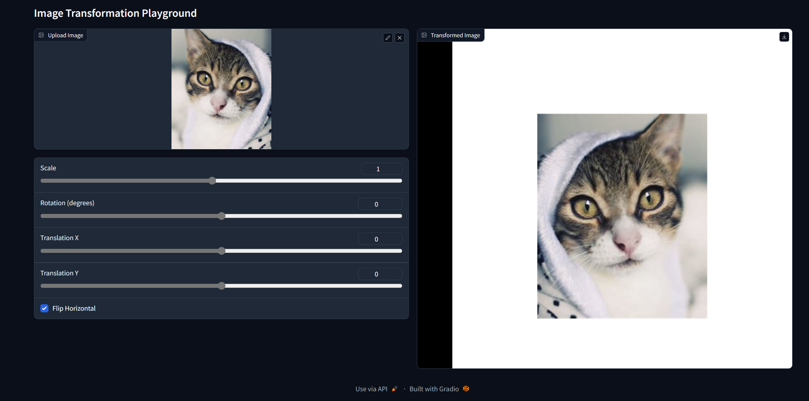

# Assignment 1 - Image Warping

[toc]


## Implementation of Image Geometric Transformation

## Requirements

To install requirements:

```setup
python -m pip install -r requirements.txt
```


## Running

To run basic transformation, run:

```basic
python run_global_transform.py
```

To run point guided transformation, run:

```point
python run_point_transform.py
```


## Results

### Basic Transformation
#### GIF展示


#### Scale

变换矩阵为
$$
\left[
 \begin{matrix}
   scale & 0 & 0 \\
   0 & scale & 0 \\
   0 & 0 & 1
  \end{matrix}
  \right] \tag{1}
$$


#### Rotation

变换矩阵为
$$
\left[
 \begin{matrix}
   cos(rotation) & -sin(ratation) & 0 \\
   sin(ratation) & cos(rotation) & 0 \\
   0 & 0 & 1
  \end{matrix}
  \right] \tag{2}
$$


#### Translation

变换矩阵为
$$
\left[
 \begin{matrix}
   1 & 0 & translation\_x \\
   0 & 1 & translation\_y \\
   0 & 0 & 1
  \end{matrix}
  \right] \tag{3}
$$


#### 中心变换操作

Scale和Rotation需要关于中心点进行操作，所以需要在上面基本的运算之前先平移到图片的左上角之后进行相应操作，然后再平移回中心点，从而实现关于中心进行缩放和旋转的效果。


#### Flip

镜像操作即为将图像的x轴进行倒序操作，直接使用cv库中的函数`cv2.flip(image, 1)` 




### Point Guided Deformation

#### GIF展示图


#### 构建思路

问题描述：给定两对二维坐标的数据集合 $(x_i, y_i) (x'_i, y'_i)$ ，建立映射关系使得$(x_i, y_i)$ 可以一一对应 $(x'_i, y'_i)$ ，即给定源点集合和目标点集合来建立整张图片的坐标对应。


通过RBF(Radical Basis Function)的方式来实现这种映射关系，即选定某个径向函数（论文中为$g(t)=t^2ln(t)$ ）来衡量其他坐标点到给定锚点的距离，从而来确定这些坐标的对应。而RBF插值方法是$R^d->R$ 的对应关系，所以需要分别对x，y坐标进行变换，得到两个映射关系。


#### 具体步骤

1. 计算目标点之间两两之间的距离，得到nxn的距离矩阵；
2. 将基函数作用到距离矩阵上，得到权重矩阵；
3. 拼接该距离矩阵和多项式矩阵，得到一个(N+3)x(N+3)的方阵，并可以通过锚点对应的目标点和源点之间的对应关系，计算求解得到系数列向量；
4. 遍历目标图像的每个像素点坐标，再计算得到距离列向量、权重列向量，和之前得到的系数列向量进行点乘得到对应的变换坐标（x、y坐标分别对应一个变换）


#### 结果图展示


#### 要点分析

- 反向查找

为了避免正向变换会出现的缝隙现象，我们采取反向对应的方式来查找坐标，即通过目标点的坐标来计算得到对应源点的坐标，但也会存在四周的点没有对应的源点的可能性。

- 纯径向函数

使用纯径向函数法的显示效果不太好


- 其他基函数

测试了多种的radical basis function，效果展示如下：


#### 参考资料

[Teaching Slides](https://rec.ustc.edu.cn/share/afbf05a0-710c-11ef-80c6-518b4c8c0b96) 

[Paper: Image Warping by Radial Basis Functions](https://www.sci.utah.edu/~gerig/CS6640-F2010/Project3/Arad-1995.pdf) 

[[经典的图像warping方法\] Thin Plate Spline: TPS理论和代码详解-CSDN博客](https://blog.csdn.net/g11d111/article/details/128641313) 

