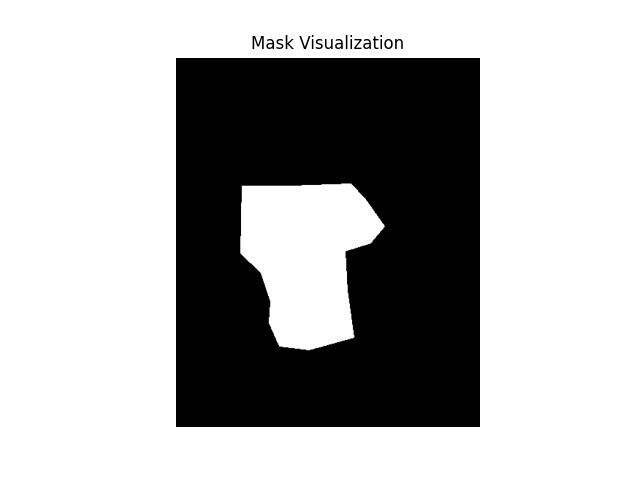
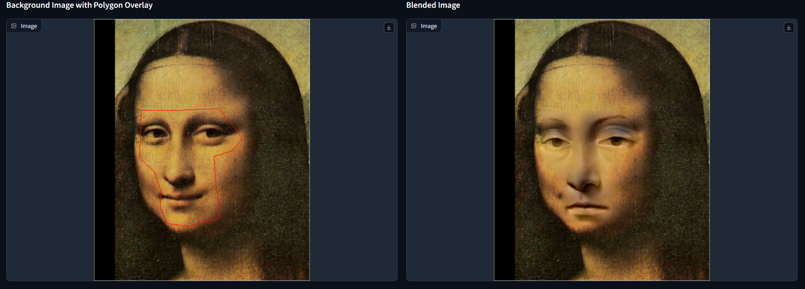
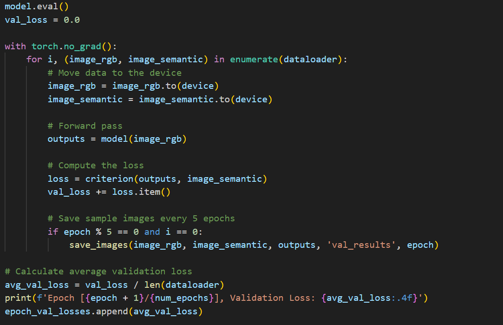

# Assignment 2 - DIP with PyTorch

[toc]

> In this assignment, you will implement traditional DIP (Poisson Image Editing) and deep learning-based DIP (Pix2Pix) with PyTorch.

## Poisson Image Editing
>  Fill the [Polygon to Mask function](run_blending_gradio.py#L95) and the [Laplacian Distance Computation](run_blending_gradio.py#L115) of `run_blending_gradio.py`.

### 算法核心

一个简单的泊松方程融合方法为求解变分方程：

$$
\min_f \int_\Omega |\nabla f|^2 \, \text{with} \, f|_{\partial \Omega} = f^*|_{\partial \Omega}
$$
其解函数需要满足调和方程：
$$
\Delta f = 0 \, \text{ over } \, \Omega \, \text{ with } \, f|_{\partial \Omega} = f^*|_{\partial \Omega}
$$


而相比于上面的直接设定，使用一个指导向量场对变分方程进行改进的效果更好：


$$
\min_f \int_\Omega |\nabla f-\mathbf{v}|^2 \, \text{with} \, f|_{\partial \Omega} = f^*|_{\partial \Omega}
$$
其解应满足下面的方程：


$$
\Delta f = div\mathbf{v} \, \text{ over } \, \Omega \, \text{ with } \, f|_{\partial \Omega} = f^*|_{\partial \Omega}
$$


在具体的离散化求解时，作者在文章中建议，对于一个主观选取的形状，使用变分求解方式要比求解泊松方程的解更合适。所以我们直接对变分方程进行参数优化，通过梯度下降法找到最优解。

> For Dirichlet boundary conditions defined on a boundary of arbitrary shape, it is best to discretize the variational problem directly, rather than the Poisson equation.


### 关键步骤

`gradio`操作流程gif如下所示：


关键步骤有以下几步：

通过选取点来构建多边形掩膜，其掩膜的操作和可视化图形如下所示：



计算误差值


进行梯度下降优化参数


### 结果展示

`equation` 


`monolisa` 




`water` 


`yan` 


## Pix2Pix

### 数据集

| 名称                                                         | 修改时间         | 大小 |
| ------------------------------------------------------------ | ---------------- | ---- |
| [cityscapes.tar.gz](https://efrosgans.eecs.berkeley.edu/pix2pix/datasets/cityscapes.tar.gz) | 2018-09-02 08:45 | 99M  |
| [edges2handbags.tar.gz](https://efrosgans.eecs.berkeley.edu/pix2pix/datasets/edges2handbags.tar.gz) | 2018-09-02 08:55 | 8.0G |
| [edges2shoes.tar.gz](https://efrosgans.eecs.berkeley.edu/pix2pix/datasets/edges2shoes.tar.gz) | 2018-09-02 08:58 | 2.0G |
| [facades.tar.gz](https://efrosgans.eecs.berkeley.edu/pix2pix/datasets/facades.tar.gz) | 2018-09-02 08:58 | 29M  |
| [maps.tar.gz](https://efrosgans.eecs.berkeley.edu/pix2pix/datasets/maps.tar.gz) | 2018-09-02 08:58 | 239M |
| [night2day.tar.gz](https://efrosgans.eecs.berkeley.edu/pix2pix/datasets/night2day.tar.gz) | 2018-09-08 17:19 | 1.9G |

以上为代码库中提供的几个数据集。

```bash
bash download_facades_dataset.sh
python train.py
```

The provided code will train the model on the [Facades Dataset](https://cmp.felk.cvut.cz/~tylecr1/facade/). You need to use [other datasets](https://github.com/phillipi/pix2pix#datasets) containing more images for better generalization on the validation set.

先通过脚本下载数据集的数据，然后进行模型训练，并通过测试来展示模型的结果。


### 实现逻辑

构建CNN网络


正向传播过程


反向传播训练网络


输出训练误差和测试误差





保存模型


### 结果展示

#### Facades(400)

使用Facades数据集进行训练

**学习曲线：**

.png)

显然存在训练误差低于测试误差的情况，说明模型存在过拟合的问题，可以简化模型架构或者增加训练数据来改善这一情况。


**训练结果：**

epoch 50


epoch 500


**测试结果：**

epoch 50


epoch 500


#### night2day(20k)

**学习曲线：**


相较于上面的Facades而言，训练误差和验证误差基本一致，表示其不存在过拟合的情况，但整体误差还是很大，代表模型的选取并不好。


**训练结果：**

epoch 50


epoch 250


**测试结果：**

epoch 50


epoch 250


#### edges2shoes(50k)

**训练结果：**

epoch 50


epoch 150


**测试结果：**

epoch 50


epoch 150


但总体来看CNN的效果并不好，可能是模型的参数选择不太合理，也有可能是CNN模型本身的架构限制了其生成的能力。


## 参考资料

- [Assignment Slides](https://rec.ustc.edu.cn/share/705bfa50-6e53-11ef-b955-bb76c0fede49)  
- [Paper: Poisson Image Editing](https://www.cs.jhu.edu/~misha/Fall07/Papers/Perez03.pdf)
- [Paper: Image-to-Image Translation with Conditional Adversarial Nets](https://phillipi.github.io/pix2pix/)
- [Paper: Fully Convolutional Networks for Semantic Segmentation](https://arxiv.org/abs/1411.4038)
- [Code: Pix2Pix](https://phillipi.github.io/pix2pix/) 
