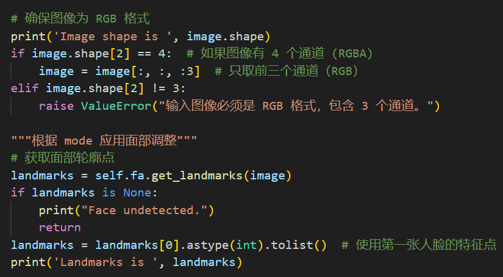

# Play with GANs

[toc]

## Improved Pixel2Pixel

> 在上一次使用CNN来实现Pixel2Pixel的过程中发现效果并不理想，这可能是因为CNN模型架构和损失函数的选取不够好。这里我们使用新的GAN架构和损失函数来实现更逼真的效果。
>
> Incremental work

### 网络结构

根据论文中的描述对GAN的网络结构进行设计，生成器使用UNet网络，输入进行通道数扩展，从3扩展到64，空间维度不变，然后进行五次下采样后得到bottleneck层，再进行五次上采样后进行卷积输出，同时将通道数进行还原。


使用torchviz工具可以将UNet网络进行可视化：


判别器使用PatchGAN：


进行误差反向传播的训练：


### 结果展示

注意到有部分测试的数据集的输入数据和输出数据与论文中的**并不对应**，例如facades和cityscapes数据集。

所以需要在dataset里对输入输出图像的截取进行更改，对`facades_datasets.py`分割读取部分进行修改。

```python
image = torch.from_numpy(img_color_semantic).permute(2, 0, 1).float()/255.0 * 2.0 -1.0
image_rgb = image[:, :, :256]
image_semantic = image[:, :, 256:]
```

#### facades

学习曲线：


训练结果：

epoch=50


epoch=500


测试结果：

epoch=50


epoch=500


#### cityscapes

学习曲线：


训练结果：

epoch=50


epoch=500


测试结果：

epoch=50


epoch=500


#### night2day

学习曲线：


训练结果：

epoch=50


epoch=500


epoch=1000


测试结果：

epoch=50


epoch=500


epoch=1000


#### edges2shoes

学习曲线：


训练结果：

epoch=50


epoch=500


测试结果：

epoch=50


epoch=500


#### edges2handbag

学习曲线：


训练结果：

epoch=50


epoch=500


测试结果：

epoch=50


epoch=500


## AutoDragGAN

> DragGAN可以通过手动控制两个控制点来获得有控制的生成，但对一些常见的表情转换来说还是较为麻烦。而Face Alignment可以对图像数据进行人脸的控制点2D和3D的检测。
>
> 所以通过先自动生成面部控制点，然后对常见的表情进行控制点的自动图像变换，从而减少人工操作的步骤。调用DragGAN即可实现组合式的工作。
>
> Combination work

### Face Alignment

#### 安装测试

直接pip安装该库，`pip install face-alignment`

进行测试：

```python
import face_alignment
from skimage import io

fa = face_alignment.FaceAlignment(face_alignment.LandmarksType._2D, flip_input=False)
# 似乎1.3版本和1.4版本不同，1.4的版本用的是.TWO_D而非._2D

input_image = io.imread('../assets/ikun.jpg')
preds = fa.get_landmarks(input_image)
```

初次运行会从torch下载checkpoints


输出的preds为一个包含一个元组的列表，其元组的维度为(68, 2)，其内部存储了识别控制点的位置坐标。

可将控制点绘制在原有图片上进行展示。


#### 标记点标准

为了实现自动化的表情编辑，需要了解这68个点所标记的具体位置，根据调研可知这些点都是有顺序标准的，具体参考位置如下所示：


下颚线：1-17

眉毛：18-22，23-27

鼻子：28-31，32-36

眼睛：37-42，43-48

嘴唇：49-60，61-68

### DragGAN

经过繁琐的环境配置和下载，包括以下步骤和问题：

1. git clone 官方仓库里的内容（[XingangPan/DragGAN: Official Code for DragGAN (SIGGRAPH 2023)](https://github.com/XingangPan/DragGAN)）；
1. `conda env create -f environment.yml` 进行环境配置，安装名为`stylegan3`；
1. 安装提示cudatoolkit存在版本问题，删除后重新配置，安装pytorch；
1. 运行出现`AttributeError: module 'distutils' has no attribute '_msvccompiler'` ，查找后根据[AttributeError: module 'distutils' has no attribute '_msvccompiler' · Issue #136541 · pytorch/pytorch](https://github.com/pytorch/pytorch/issues/136541)更改版本问题，将setuptools的版本限制在72.1.0；
1. 下载预训练的模型参数，可以使用仓库里的下载脚本，还可以自行去找模型参数，我找了ffhq数据集下的StyleGAN模型参数，下载地址是[StyleGAN3 pretrained models | NVIDIA NGC](https://catalog.ngc.nvidia.com/orgs/nvidia/teams/research/models/stylegan3/files) ；
1. 输入运行`./scripts/gui.bat `来运行GUI界面（或者指定模型，运行`python visualizer_drag.py stylegan2-ffhq-512x512.pkl`），同时导出conda环境设置。


### 将二者融合

根据上面的讨论，为了自动得到不同表情的相应变换，可以通过不同表情的特点进行DragGAN的起始点和终止点的设定，从而实现不同表情。

下面列举几种常见的表情编辑：

闭眼：(38, 42) 两个点与二者的中点重合

大眼：设定38->42的射线，让38与42互相远离

闭嘴：(63, 67) 两个点与二者的中点重合

张嘴：(63, 52), (67, 58)

瘦脸：设定2->16的射线，让2与16互相接近


首先要对前端页面进行修改，添加不同表情下对应的按钮，从而来对控制点进行设定。


这里添加了一个可折叠面板`Face Adjustments`，里面添加了多个表情按钮，并通过是否点击来赋值`self.adjustment_mode`，从而对当前的模式进行跟踪。


接着调用face-alignment，对接时有两点值得注意：一是图片的通道不同，DragGAN为RGBA四个通道，而face-alignment库的输入需要RGB三个通道；二的是输出的坐标系和DragGAN中使用的并不一致，二者的原点都是图像的左上角，但是DragGAN的竖直方向是x轴，而水平方向是y轴，与face-alignment相反。



读取图片这里要先对通道数进行截取。


然后对不同表情模式的起始终止点进行控制，按照之前对不同表情的控制点进行设定。


注意最后设定`self.drag_widget.points`和`self.drag_widget.targets`的时候需要进行内部坐标的翻转，这样才能让二者对应起来。


最后在变动表情的时候往往会对整体的表情都有影响，对部分的生成图像会造成面部变形，所以最好能在变换表情前添加一步mask的添加步骤，从而只改变局部区域而不影响其他区域。

这一步没有添加上，大致思路和之前做Poisson Image Editing类似，通过周边的点来对`self.drag_widget.mask`掩膜进行设定。

原文仓库中还提到可以使用[PTI](https://github.com/danielroich/PTI)工具对真实图像（非GAN直接生成）进行修改。


### 结果展示

输入`python .\visualizer_drag_auto.py .\checkpoints\stylegan2-ffhq-512x512.pkl` 加载模型，设定latent来获取不同的合成图像。

需要**首先点击Start按钮**（为了让`self.drag_widget.points`属性初始化），选择想要的表情，识别后会将控制点显示在图上，再次点击按钮Start，等待一段时间即可获取结果。


闭眼 latent=18


大眼 latent=37


闭嘴 latent=12


张嘴 latent=30


瘦脸 latent=39


## 参考资料
- [Paper: Image-to-Image Translation with Conditional Adversarial Networks](https://arxiv.org/abs/1611.07004)
- [DragGAN](https://vcai.mpi-inf.mpg.de/projects/DragGAN/): [Implementaion 1](https://github.com/XingangPan/DragGAN) & [Implementaion 2](https://github.com/OpenGVLab/DragGAN) 
- [Facial Landmarks Detection](https://github.com/1adrianb/face-alignment) 
- [68 facial landmarks. | Download Scientific Diagram](https://www.researchgate.net/figure/facial-landmarks_fig1_338048224) 
- [[1703.07332\] How far are we from solving the 2D & 3D Face Alignment problem? (and a dataset of 230,000 3D facial landmarks)](https://arxiv.org/abs/1703.07332) 
- [danielroich/PTI: Official Implementation for "Pivotal Tuning for Latent-based editing of Real Images" (ACM TOG 2022) https://arxiv.org/abs/2106.05744](https://github.com/danielroich/PTI) 
- [NVlabs/stylegan3: Official PyTorch implementation of StyleGAN3](https://github.com/NVlabs/stylegan3) 
- [stylegan-human/StyleGAN-Human: StyleGAN-Human: A Data-Centric Odyssey of Human Generation](https://github.com/stylegan-human/StyleGAN-Human) 

