# Implement Simplified 3D Gaussian Splatting

> This assignment covers a complete pipeline for reconstructing a 3D scene represented by 3DGS from multi-view images.


[toc]

## Implement Procedures

### Step 1. Structure-from-Motion

首先需要下载安装colmap，在colmap[官方仓库](https://github.com/colmap/colmap/releases/tag/3.11.0)上下载bin文件，然后配置环境变量：

```
export PATH=$PATH:<yourpathhere>\\colmap-x64-windows-cuda\\bin
```


First, we use Colmap to recover camera poses and a set of 3D points. 将多视角图片转为三维点

```
python mvs_with_colmap.py --data_dir ../data/lego
```

生成sparse文件夹，里面包含了相机位置、点云的位置、投影图像点的位置坐标。


Debug the reconstruction by running:

```
python debug_mvs_by_projecting_pts.py --data_dir ../data/lego
```

对比原有的多视角图片来验证是否生成是正确的。

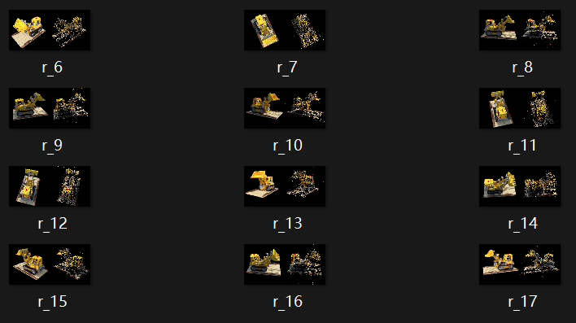


### Step 2. A Simplified 3D Gaussian Splatting

From the debug output of Step 1, you can see that the 3D points are sparse for rendering the whole image. We will expand each point to a 3D Gaussian to make it cover more 3D space.

计算得到的三维点云很稀疏，因此我们需要对每个点进行扩展来覆盖更多空间。

#### 2.1 3D Gaussians Initialization
Refer to the [original paper](https://repo-sam.inria.fr/fungraph/3d-gaussian-splatting/3d_gaussian_splatting_low.pdf). For converting 3D points to 3D Gaussians, we need to define the covariance matrix for each point; 

the initial Gaussians' centers are just the points. According to equation (6), for defining covariance, we define a scaling matrix S and a rotation matrix R. 
$$
\Sigma=RSS^TR^T
$$
通过旋转矩阵和缩放矩阵来定义高斯的协方差矩阵。


Since we need to use the 3D Gaussians for volume rendering, we also need **the opacity attribute and the color attribute for each Gaussian**. The volume rendering process is formulated with equations (1), (2), (3).
$$
C = \sum_{i=1}^N T_i \left(1 - \exp(-\sigma_i \delta_i)\right) c_i, \quad \text{with} \quad T_i = \exp\left(-\sum_{j=1}^{i-1} \sigma_j \delta_j \right),
$$

$$
C = \sum_{i=1}^NT_i\alpha_i\bold{c_i}
$$

$$
C=\sum_{i\in N}c_i \alpha_i \prod^{i-1}_{j=1}(1-\alpha_j)
$$


[The code here](gaussian_model.py#L32) contains functions to **initialize these attributes as optimizable parameters**. You need to fill [the code here](gaussian_model.py#L103) for computing the 3D Covariance matrix from the **quaternion** (for rotation) and the **scaling parameters**.


#### 2.2 Project 3D Gaussians to Obtain 2D Gaussians
According to equation (5), we need to project the 3D Gaussians to the image space by transforming with **the world to camera transformation *_W_*** and the **Jacobian matrix *_J_* of the projection transformation**. 
$$
\Sigma'=JW\Sigma W^TJ^T
$$
将世界坐标系转为相机坐标系的变化，和相应的仿射投影的雅可比矩阵。


You need to fill [the code here](gaussian_renderer.py#L26) for computing the projection.

补充代码如下：

```python
    def compute_projection(
        self,
        means3D: torch.Tensor,          # (N, 3) 3D points in world coordinates
        covs3d: torch.Tensor,           # (N, 3, 3) 3D covariance matrices
        K: torch.Tensor,                # (3, 3) Intrinsic matrix
        R: torch.Tensor,                # (3, 3) Rotation matrix (World to Camera)
        t: torch.Tensor                 # (3) Translation vector
    ) -> Tuple[torch.Tensor, torch.Tensor, torch.Tensor]:
        N = means3D.shape[0]
        
        # 1. Transform points to camera space
        cam_points = means3D @ R.T + t.unsqueeze(0) # (N, 3)
        
        # 2. Get depths before projection for proper sorting and clipping
        depths = cam_points[:, 2].clamp(min=1.)  # (N, )
        
        # 3. Project to screen space using camera intrinsics
        screen_points = cam_points @ K.T  # (N, 3)
        means2D = screen_points[..., :2] / screen_points[..., 2:3] # (N, 2)
        
        # 4. Transform covariance to camera space and then to 2D
        # Compute Jacobian of perspective projection
        J_proj = torch.zeros((N, 2, 3), device=means3D.device)
        x, y, z = cam_points[:, 0], cam_points[:, 1], cam_points[:, 2].clamp(min=1.)
        J_proj[:, 0, 0] = K[0, 0] / z
        J_proj[:, 0, 2] = -x * K[0, 0] / z**2
        J_proj[:, 1, 1] = K[1, 1] / z
        J_proj[:, 1, 2] = -y * K[1, 1] / z**2
        
        # Transform covariance to camera space
        ### FILL: Aplly world to camera rotation to the 3d covariance matrix
        covs_cam = torch.bmm(R.unsqueeze(0).expand(N, -1, -1), torch.bmm(covs3d, R.T.unsqueeze(0).expand(N, -1, -1)))  # (N, 3, 3)
        # Project to 2D
        covs2D = torch.bmm(J_proj, torch.bmm(covs_cam, J_proj.permute(0, 2, 1)))  # (N, 2, 2)
        return means2D, covs2D, depths
```


#### 2.3 Compute the Gaussian Values
We need to compute 2D Gaussians for volume rendering. A 2D Gaussian is represented by:

$$
\begin{aligned}

f(\mathbf{x}; \boldsymbol{\mu}_{i}, \boldsymbol{\Sigma}_{i}) 

&= \frac{1}{2 \pi \sqrt{ | \boldsymbol{\Sigma}_{i} |}} 

\exp \left ( {-\frac{1}{2}} (\mathbf{x} - \boldsymbol{\mu}_{i})^T \boldsymbol{\Sigma}_{i}^{-1} (\mathbf{x} - \boldsymbol{\mu}_{i}) \right ) \\

&= \frac{1}{2 \pi \sqrt{ | \boldsymbol{\Sigma}_{i} |}} \exp \left ( P_{(\mathbf{x}, i)} \right )

\end{aligned}
$$

Here, $\mathbf{x}$ is a 2D vector representing the pixel location, $\boldsymbol{\mu}$ represents a 2D vector representing the mean of the $i$-th 2D Gaussian, and $\boldsymbol{\Sigma}$ represents the covariance of the 2D Gaussian. The exponent part $P_{(\mathbf{x}, i)}$ is:

$$
P_{(\mathbf{x}, i)} = 

{-\frac{1}{2}} (\mathbf{x} - \boldsymbol{\mu}_{i})^T \mathbf{\Sigma}_{i}^{-1} (\mathbf{x} - \boldsymbol{\mu}_{i})
$$

You need to fill [the code here](gaussian_renderer.py#L61) for computing the Gaussian values.

补充代码如下：

```python
    def compute_gaussian_values(
        self,
        means2D: torch.Tensor,    # (N, 2)
        covs2D: torch.Tensor,     # (N, 2, 2)
        pixels: torch.Tensor      # (H, W, 2)
    ) -> torch.Tensor:           # (N, H, W)
        N = means2D.shape[0]
        H, W = pixels.shape[:2]
        
        # Compute offset from mean (N, H, W, 2)
        dx = pixels.unsqueeze(0) - means2D.reshape(N, 1, 1, 2)
        
        # Add small epsilon to diagonal for numerical stability
        eps = 1e-4
        covs2D = covs2D + eps * torch.eye(2, device=covs2D.device).unsqueeze(0)     # (N, 2, 2)
        covs2D = covs2D.unsqueeze(1).unsqueeze(1)   # (N, 1, 1, 2, 2)
        
        # Compute determinant for normalization
        ### FILL: compute the gaussian values
        gaussian = 1/(2*math.pi*torch.sqrt(torch.det(covs2D))) * \
            torch.exp(-0.5 * (dx.unsqueeze(3) @ torch.inverse(covs2D) @ dx.unsqueeze(3).permute(0, 1, 2, 4, 3)).squeeze(-1).squeeze(-1))  # (N, H, W)
        return gaussian
```


#### 2.4 Volume Rendering (α-blending)
According to equations (1-3), using these `N` ordered 2D Gaussians, we can **compute their alpha and transmittance values** at each pixel location in an image.

The alpha value of a 2D Gaussian $i$ at a single pixel location $\mathbf{x}$ can be calculated using:


$$
\alpha_{(\mathbf{x}, i)} = o_i*f(\mathbf{x}; \boldsymbol{\mu}_{i}, \boldsymbol{\Sigma}_{i})
$$

Here, **$o_i$ is the opacity of each Gaussian, which is a learnable parameter.**


Given `N` ordered 2D Gaussians, the transmittance value of a 2D Gaussian $i$ at a single pixel location $\mathbf{x}$ can be calculated using:

$$
T_{(\mathbf{x}, i)} = \prod_{j \lt i} (1 - \alpha_{(\mathbf{x}, j)})
$$

Fill [the code here](gaussian_renderer.py#L83) for final rendering computation.

补充代码如下：

```python
    def forward(
            self,
            means3D: torch.Tensor,          # (N, 3)
            covs3d: torch.Tensor,           # (N, 3, 3)
            colors: torch.Tensor,           # (N, 3)
            opacities: torch.Tensor,        # (N, 1)
            K: torch.Tensor,                # (3, 3)
            R: torch.Tensor,                # (3, 3)
            t: torch.Tensor                 # (3, 1)
    ) -> torch.Tensor:
        N = means3D.shape[0]
        
        # 1. Project to 2D, means2D: (N, 2), covs2D: (N, 2, 2), depths: (N,)
        means2D, covs2D, depths = self.compute_projection(means3D, covs3d, K, R, t)
        
        # 2. Depth mask
        valid_mask = (depths > 1.) & (depths < 50.0)  # (N,)
        
        # 3. Sort by depth
        indices = torch.argsort(depths, dim=0, descending=False)  # (N, )
        means2D = means2D[indices]      # (N, 2)
        covs2D = covs2D[indices]       # (N, 2, 2)
        colors = colors[ indices]       # (N, 3)
        opacities = opacities[indices] # (N, 1)
        valid_mask = valid_mask[indices] # (N,)
        
        # 4. Compute gaussian values
        gaussian_values = self.compute_gaussian_values(means2D, covs2D, self.pixels)  # (N, H, W)
        
        # 5. Apply valid mask
        gaussian_values = gaussian_values * valid_mask.view(N, 1, 1)  # (N, H, W)
        
        # 6. Alpha composition setup
        alphas = opacities.view(N, 1, 1) * gaussian_values  # (N, H, W)
        colors = colors.view(N, 3, 1, 1).expand(-1, -1, self.H, self.W)  # (N, 3, H, W)
        colors = colors.permute(0, 2, 3, 1)  # (N, H, W, 3)
        
        # 7. Compute weights
        ### FILL:
        cumulative_alphas = torch.cumsum(alphas, dim=0)  # (N, H, W), cumulative sum of alphas
        weights = alphas * (1 - cumulative_alphas)  # Compute weights for each pixel, (N, H, W)
        
        # 8. Final rendering
        rendered = (weights.unsqueeze(-1) * colors).sum(dim=0)  # (H, W, 3)
        
        return rendered
```


### Results

先安装一些库

```
pip install tqdm natsort opencv-python-headless pytorch
conda install pytorch3d -c pytorch3d -c conda-forge -c nvidia
```

直接使用conda会安装cpu版本的pytorch

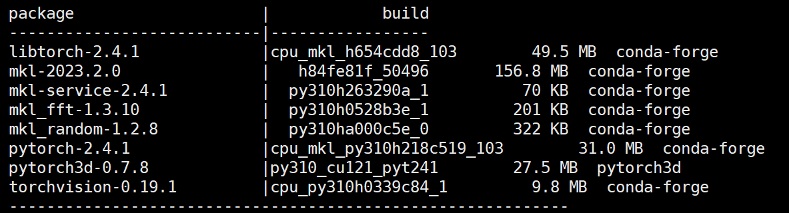

注意安装的pytorch是2.4.1版本的，可能有兼容的问题然后进行手动安装


After implementation, build your 3DGS model:
```
python train.py --colmap_dir ../data/lego --checkpoint_dir ../data/lego/checkpoints

python train.py --colmap_dir ../data/chair --checkpoint_dir ../data/chair/checkpoints
```


但遇到了报错：

```
Traceback (most recent call last):
  File "/exports/d3/hhr346/04_3DGS/pytorch/train.py", line 351, in <module>
    main()
  File "/exports/d3/hhr346/04_3DGS/pytorch/train.py", line 304, in main
    dataset = ColmapDataset(args.colmap_dir)
  File "/exports/d3/hhr346/04_3DGS/pytorch/data_utils.py", line 127, in __init__
    self.points3D_rgb = torch.as_tensor(np.array([p['rgb'] for p in points3D.values()])).float()
RuntimeError: Could not infer dtype of numpy.int64
```

检查时出现了类型错误，所以将该处的type进行更改：

```
# self.points3D_rgb = torch.as_tensor(np.array([p['rgb'] for p in points3D.values()])).float()
self.points3D_rgb = torch.as_tensor(np.array([p['rgb'] for p in points3D.values()]), dtype=torch.float32)
```


#### lego

lego的结果比较图如下：

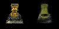

#### chair

chair的结果比较图如下：

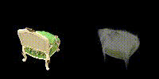


## Compare with the original 3DGS Implementation

Since we use a pure PyTorch implementation, the training speed and GPU memory usage are far from satisfactory. Also, we do not implement some crucial parts like adaptive Gaussian densification scheme. Run the [original 3DGS implementation](https://github.com/graphdeco-inria/gaussian-splatting) with the same dataset to compare the results.

因为我们使用的是纯PyTorch版本的实现，训练速度和GPU利用率都不好，同时缺少动态高斯加密策略这样的关键步骤，所以可以和官方的实现进行比较。

首先克隆远程仓库：
```
git clone git@github.com:graphdeco-inria/gaussian-splatting.git
```

然后配置conda环境：

```
conda env create -f "environment.yaml"
```


然后下载安装里面的子模块，官网给的第三个子模块的链接挂了，用的是这个[issue: simple-knn @ 86710c2____LINK DEATH · Issue #1036 · graphdeco-inria/gaussian-splatting](https://github.com/graphdeco-inria/gaussian-splatting/issues/1036)里提到的。

```
cd submodules/
rm * -r
git clone git@github.com:graphdeco-inria/diff-gaussian-rasterization.git
git clone git@github.com:rahul-goel/fused-ssim.git
git clone git@github.com:camenduru/simple-knn.git
```


`diff-gaussian-rasterization`里还有个glm的第三方库：

```
cd third_party
rm glm -r
git clone git@github.com:g-truc/glm.git
```

或许用git管理submodule的命令一次性clone比较好：

```
git submodule update --init --recursive
```

```
git clone --recurse-submodules 
```


然后返回到`diff-gaussian-rasterization`文件夹进行setup，对`simpleknn`和`fused-ssim`文件夹也是一样的操作

```
python setup.py install
```


最后运行为：

```
python train.py -s ../data/lego/
python render.py -m <path to trained model>
```

遇到了以下问题：

```
File "/gaussian-splatting/gaussian_renderer/__init__.py", line 49, in render antialiasing=pipe.antialiasing TypeError: __new__() got an unexpected keyword argument 'antialiasing'
```

根据[I keep getting the following error when i train · Issue #1032 · graphdeco-inria/gaussian-splatting](https://github.com/graphdeco-inria/gaussian-splatting/issues/1032)这个相同的问题，提出的解决方法是`pip install ./submodules/diff-gaussian-rasterization`，尝试之后无果

查看源码发现是这个设置类的差别，git clone得到的代码不是最新版本！

下面是clone之后的代码

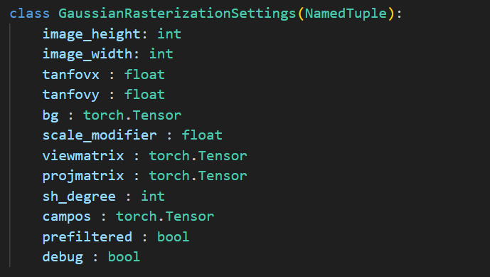


下面是网页上的版本：

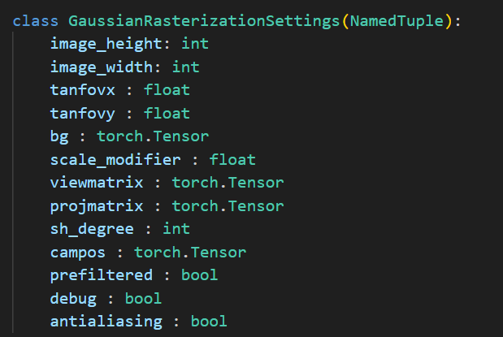


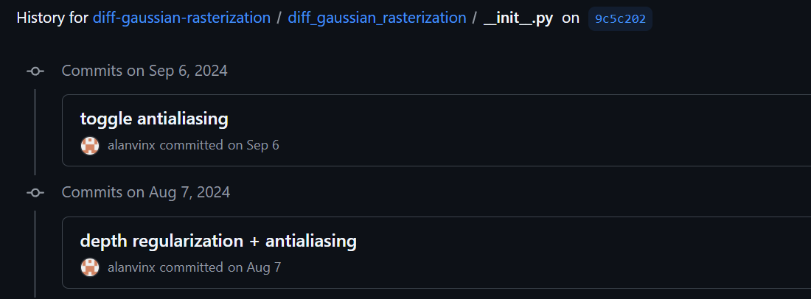

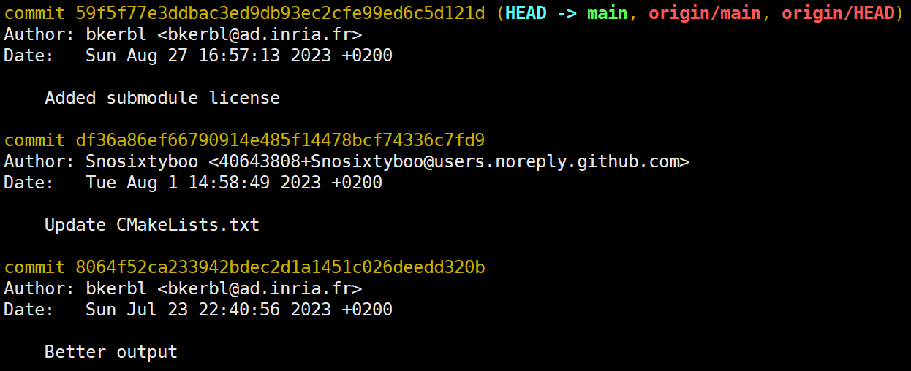

所以要么下载安装包进行安装，要么`git checkout 9c5c202`之后重新安装。


### Results

两个路径下的结果比较奇怪，但过程并没有任何报错，下面是训练和渲染的运行过程。

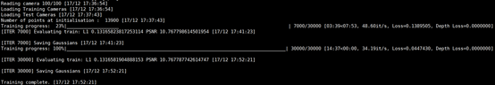

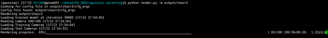


然后render文件夹里的显示的结果图就比较奇特：

#### chair

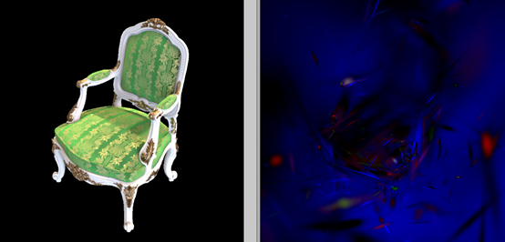

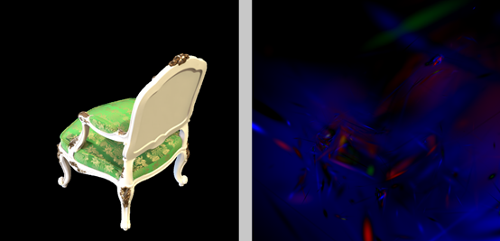


尝试了很多官方给的图片，也试过官方路径下的`python convert.py <dir>`  来转换图片，但都不行，并且用convert.py转换的老师的lego和chair的image文件夹里的图片都很少

render的结果都要么全黑要么是非常奇怪的结果：

#### lego

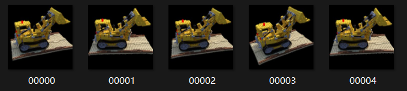

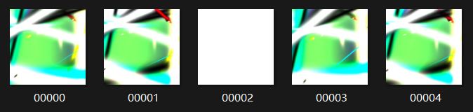


#### playroom

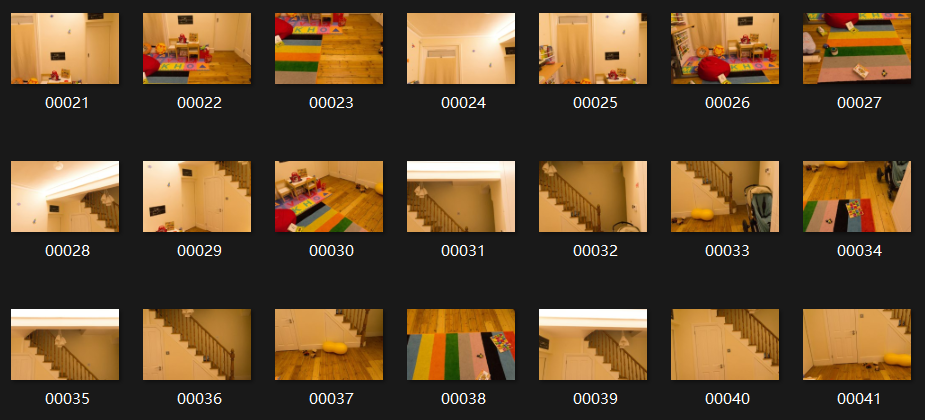

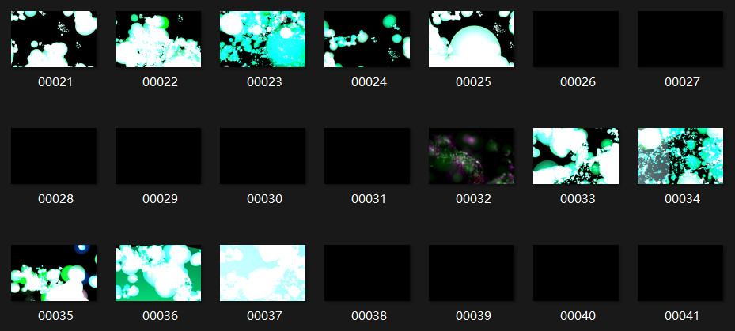

#### train

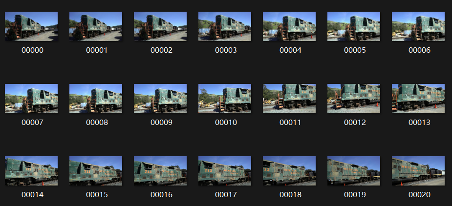

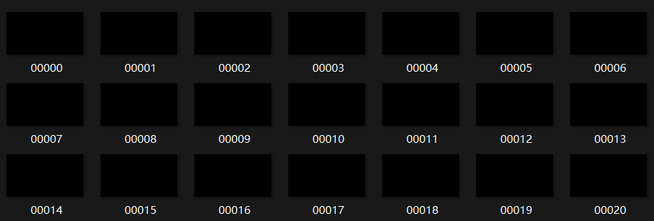


#### truck

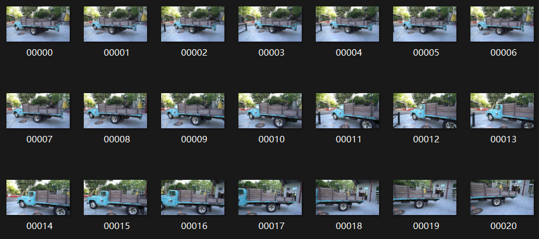

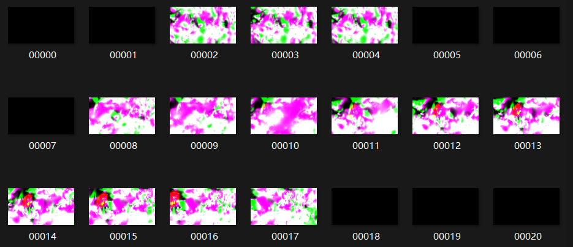


## Resources

- [Paper: 3D Gaussian Splatting](https://repo-sam.inria.fr/fungraph/3d-gaussian-splatting/)
- [3DGS Official Implementation](https://github.com/graphdeco-inria/gaussian-splatting)
- [Colmap for Structure-from-Motion](https://colmap.github.io/index.html) 
- [3d gaussian-splatting源码运行及结果展示_gaussian splatting 输出bin文件-CSDN博客](https://blog.csdn.net/qq_45488453/article/details/138678747)
- [Getting Started With 3D Gaussian Splatting for Windows (Beginner Tutorial)](https://www.youtube.com/watch?v=UXtuigy_wYc) 

